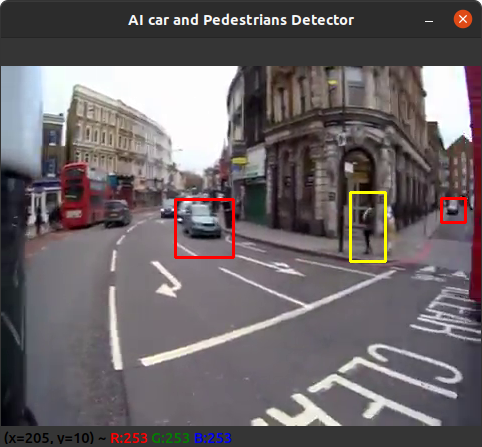

# AI-Based-Cars-and-pedestrian-tracking  (Using OpenCV)  
  
The below picture represent the sample output obtained when we run the program with a video to analyze and detect Cars and Pedestrian.

## The common Haar Cascade Features are shown below

## Inorder to Track and Detect Cars we use the below shown haar cascade to detect cars

